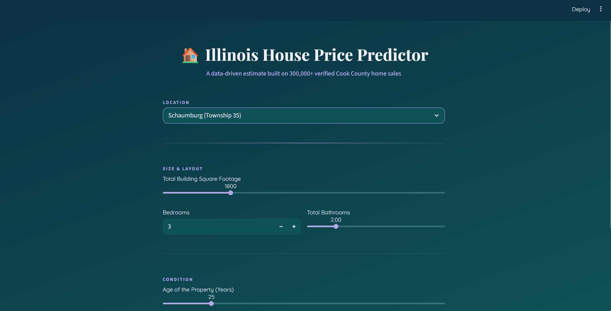

# 🏠 Illinois House Price Predictor

A machine learning web app that estimates home values in Cook County, IL, trained on 300,000+ verified property sales from the Cook County Assessor's public dataset. Built with XGBoost and deployed as an interactive Streamlit app.

## The interesting part: debugging a model that looked fine but wasn't

While testing predictions against real Zillow listings, I ran into a major accuracy problem — estimates were off by 10–50x from real values (e.g. ~$7,700 for a 1,800 sqft house in Chicago). Rather than just re-tuning hyperparameters, I dug into the pipeline and found three distinct root causes, fixing each as I went:

1. **Contaminated training data.** About 17% of the raw "sales" in the county dataset were $1 quitclaim deeds, foreclosures, and family transfers — not real market transactions. These were filtered out using the dataset's own `Pure Market Filter` flag.

2. **Target leakage in the location feature.** The model used average price-per-sqft by township (`Town_PricePerSF`) as a feature. The original version computed this average from the same rows it was predicting on, so the model partially "memorized" answers instead of learning real relationships — visible in feature importances, where square footage carried under 6% importance (nonsensical for a housing model). Fixed by computing the encoding with proper train/test separation and Bayesian smoothing (small-sample townships get pulled toward the county-wide mean instead of using a noisy local average).

3. **Mislabeled location data.** Two of the five township dropdown options pointed at the wrong real-world townships entirely (mislabeled as affluent north-suburb townships when the underlying codes were actually south-suburb townships). Caught by cross-referencing each township code's average property latitude/longitude against real map locations — a useful reminder that categorical codes from public data should be spot-checked, not assumed correct.

## Results

After cleaning, fixing the leakage, and correcting the labels:

| Metric | Value |
|---|---|
| Training rows (after cleaning) | ~306,000 (from 583,000 raw) |
| Held-out MAE | ~$87,000 |
| Held-out median absolute % error | ~26% |
| `BuildingSF` feature importance | ~26% (up from ~6% in the leaky version) |

For comparison, Zillow's published Zestimate median error is ~2.4% for on-market homes and ~7.5% for off-market homes — but Zestimate has access to live MLS listings, comparable-sale engines, price history, and computer-vision analysis of listing photos. This model works from five structural features and township-level location only, so this error rate is a reasonable result given that constraint, not a finished product.

## What I'd improve next

- Swap township-level location for the dataset's more granular Neighborhood Code (hundreds of categories vs. 38)
- Add unused property condition features already in the raw data (Central Air, Garage Size, Construction Quality, Fireplaces)
- Account for sale year / time trends — sales spanning multiple years currently get blended onto one price scale
- Add latitude/longitude as direct features, or a k-nearest-neighbor "comparable sales" feature

## Tech stack

- **Data**: [Cook County Assessor's Office Residential Property Characteristics](https://datacatalog.cookcountyil.gov/) (public data)
- **Model**: XGBoost regression, log-transformed target
- **App**: Streamlit
- **Validation**: train/test split with leak-safe target encoding, held-out MAE/MAPE

## Running it locally

1. Clone this repo
2. Install dependencies: `pip install -r requirements.txt`
3. Run the app: `python -m streamlit run app.py`

The trained model artifacts (`illinois_housing_model.pkl`, `illinois_town_map.pkl`, `town_map_meta.pkl`) are included in this repo, so the app runs out of the box — no need to retrain.

## Retraining from scratch

The full data cleaning + training pipeline is in `Illinois_Housing_Model_Training.ipynb`. To rerun it:

1. Download the residential property characteristics CSV from the [Cook County Open Data Portal](https://datacatalog.cookcountyil.gov/)
2. Upload it to Colab (or your environment of choice) as `Cook-County-Housing.csv`
3. Run the notebook top to bottom — it cleans the data, fits the model with a leak-safe validation split, then retrains a final model on the full cleaned dataset and saves the three `.pkl` artifacts

## Disclaimer

This is a portfolio/learning project, not a real valuation tool. Estimates are ballpark figures based on limited structural and location features — not appraisals.
